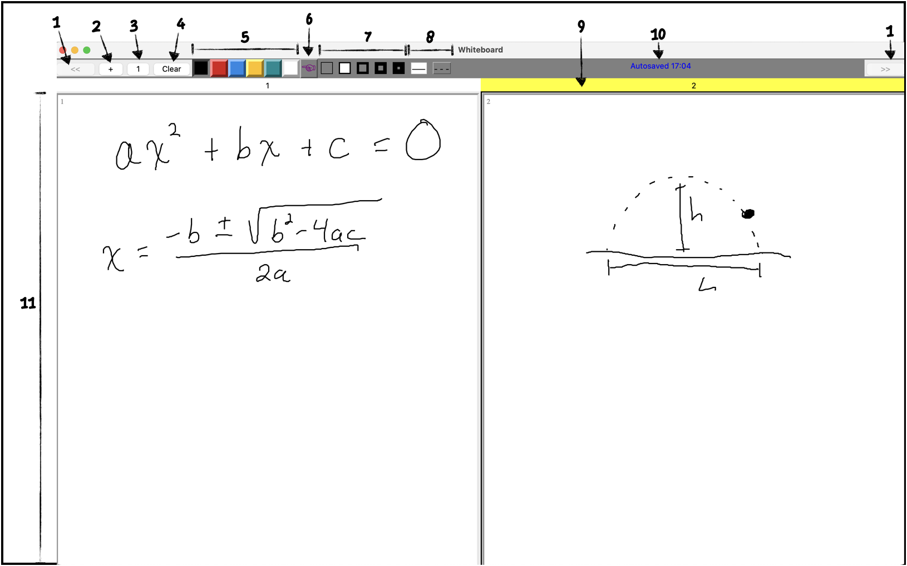

Mirrorboard is an electronic whiteboard that I use when teaching 
classes.  When another display (such as a projector) is attached,
it maintains a second window on that display in sync with the first.
You can also save your pages to PDF, and the size of the canvas
translates easily to a (American) standard 8.5x11" page.

Mirrorboard was designed for use on MacOS 12.6, and requires Tcl/Tk
8.6 and Ghostscript to be installed.  (Sadly Macs only come with
Tcl/Tk 8.5.)  It also assumes that a `/tmp` directory exists.

## Key to Screenshot
1. Go to previous/next page
2. Add a new page
3. Switch between showing two pages side-by-side (the default), or a
single page
4. Clear the current page (highlighted in yellow).
5. Change the color of the pen. Colors are chosen to avoid confusion for color-blind viewers.
6. Toggle this to show a pointer on the mirrored output wherever your
mouse is.
7. Change the thickness of the line.
8. Draw dashed or solid lines.
9. The yellow highlights the "current" page.
10. File is autosaved to a temporary directory in case of crashes.
11. Each page has the proper aspect ratio to fit nicely on a
letter-sized page.

## Menu Items
- "Save as PDF" saves the entire document as a PDF and (on a Mac)
opens it immediately in Preview.
- "Save as Text" saves the entire document in an encoded text file
(using .txt or whatever extension you like), for loading later.
- "Load" will load a previously saved document.
- "Insert..." will insert a single page from a previously saved
document into the current page.
- Undo does what you think it does; every page has its own undo stack.
- Redo, again, does what you think it does.
- Toggle Across is the same as #3 above.
- Show Mirror: typically the program will only show the mirrored page
when a second display is open.  If you want to activate it anyway,
choose this option.

## Code
- The code mostly resides in the folder
`Mirrorboard.app/Contents/Resources/Scripts/`; if you are not on a
Mac, you can `cd` into this file and run `wish8.6 AppMain.tcl` to start
the program.
- If you have TCL/Tk installed in an unusual spot, you can replace
`wish8.6` in the last line of
`Mirrorboard.app/Contents/MacOS/Mirrorboard` with the path to your
implementation.  
